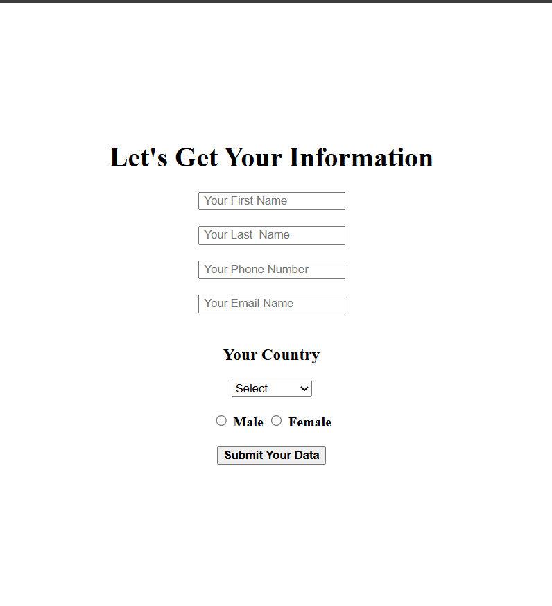

# 📋 Survey Form Using HTML

> A clean and responsive survey form built using only HTML5.

---

## 📸 Project Preview

<p align="center">
  
</p>

---

## 🚀 Live Demo

🔗 **Live Website:**  
https://joni250.github.io/survey-form-html/

---

## 📂 Repository

🔗 **GitHub Repository:**  
https://github.com/Joni250/survey-form-html

---

## ✨ Features

- ✅ Clean and responsive layout
- ✅ Semantic HTML5 structure
- ✅ User-friendly form design
- ✅ Text input fields
- ✅ Radio buttons
- ✅ Checkboxes
- ✅ Dropdown menu
- ✅ Textarea
- ✅ Submit button
- ✅ Beginner-friendly project

---

## 🛠️ Technologies Used

| Technology | Purpose |
|------------|---------|
| HTML5 | Structure & Form Design |

---

## 📁 Project Structure

```text
survey-form-html/
│── index.html
│── preview.png
│── README.md
```

---

## 🎯 Project Purpose

This project was created as part of my frontend development learning journey. It focuses on building a clean, responsive, and well-structured HTML survey form while following modern coding practices.

---

## 💡 What I Learned

- Semantic HTML5
- HTML Forms
- Labels & Input Fields
- Form Validation Basics
- Clean Code Structure
- Responsive HTML Layout

---

## 👩‍💻 Author

**Joni Khatun**

Aspiring Frontend & WordPress Developer

GitHub Profile:  
https://github.com/Joni250

---

## ⭐ Support

If you found this project helpful, consider giving it a ⭐ on GitHub.
